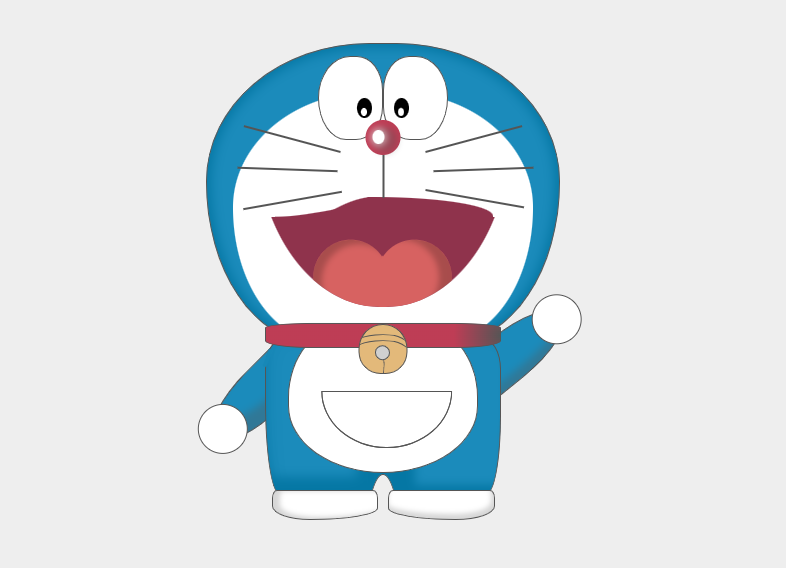

## Doraemon

Doraemon is about the life of Nobita Nobi. In a typical story Doramon uses a gadget to solve a problem for Nobita, but Nobita goes too far and ends up being punished and learning a lesson.

Doraemon was turned into an anime television show in 1979. It still is being shown on television. As of 1996, about 100 million comic books have been sold. A Japanese-to-English version of the original called Doraemon: Gadget Cat from the Future was published from 2002. A local translation is published in each Asian country such as Hong Kong, Taiwan, Korea and Vietnam. It is in the United States, Canada, the United Kingdom, and Australia, but it is not as popular as it is in Asia. Doraemon is endorsed by 7-11 in Thailand as a mascot.

URL: https://ritwickdey.github.io/doraemon-pure-css

---
Made with CSS and :heart: of me (my favorite cartoon, in case if you don't know :blush: )
